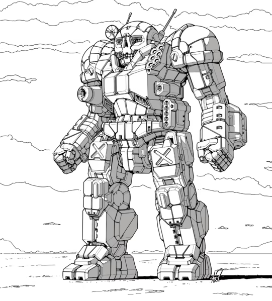

Experimental Atlas Variants
********************************************************************************

.. |fa-mech| raw:: html

    <i class="fa-fw fa-solid fa-robot"></i>

I've worked on a few custom Atlas variants representing experimental R&D in the late Succession Wars era.

AS7-X A "Magpie"
--------------------------------------------------------------------------------

This Wolf's Dragoons experimental version of the Atlas focuses on maximum speed. Engineers started with the venerable AS7-D and swapped the standard fusion engine for a clan XL engine.
Then, the single heat sinks in the engine were then replaced with double heat sinks, allowing for higher sustained fire from the unit.
Next, a supercharger was added, and the AC-20 and SRM-6 launcher were replaced with 2 PPCs, offering better damage at longer ranges.
The ultimate goal with this design is to create a fast 'scout' assault mech that can keep up with lighter units in a scout formation.

| |fa-mech| AS7-X A.1: `PDF <https://raw.githubusercontent.com/Eudicods/battletech-site/main/source/pdfs/Atlas_AS7-X_A.1.pdf>`_, `MegaMekLab file <https://raw.githubusercontent.com/Eudicods/battletech-site/main/source/mekfiles/Atlas_AS7-X_A.1.mtf>`_
| |fa-mech| AS7-X A.2: `PDF <https://raw.githubusercontent.com/Eudicods/battletech-site/main/source/pdfs/Atlas_AS7-X_A.2.pdf>`_, `MegaMekLab file <https://raw.githubusercontent.com/Eudicods/battletech-site/main/source/mekfiles/Atlas_AS7-X_A.2.mtf>`_
| |fa-mech| AS7-X A.3: `PDF <https://raw.githubusercontent.com/Eudicods/battletech-site/main/source/pdfs/Atlas_AS7-X_A.3.pdf>`_, `MegaMekLab file <https://raw.githubusercontent.com/Eudicods/battletech-site/main/source/mekfiles/Atlas_AS7-X_A.3.mtf>`_

AS7-X B "Nutcracker"
--------------------------------------------------------------------------------

This Wolf's Dragoons experimental version of the Atlas focuses on maximum firepower.
Engineers started with the venerable AS7-D and swapped the single heat sinks for clan double heat sinks.
The medium lasers and SRM launcher were then replaced with extended range large lasers to improve the damage output at range.

The ultimate goal with this design is to create a maximum damage assault platform.

| |fa-mech| AS7-X B.1: `PDF <https://raw.githubusercontent.com/Eudicods/battletech-site/main/source/pdfs/Atlas_AS7-X_B.1.pdf>`_, `MegaMekLab file <https://raw.githubusercontent.com/Eudicods/battletech-site/main/source/mekfiles/Atlas_AS7-X_B.1.mtf>`_
| |fa-mech| AS7-X B.2: `PDF <https://raw.githubusercontent.com/Eudicods/battletech-site/main/source/pdfs/Atlas_AS7-X_B.2.pdf>`_, `MegaMekLab file <https://raw.githubusercontent.com/Eudicods/battletech-site/main/source/mekfiles/Atlas_AS7-X_B.2.mtf>`_

