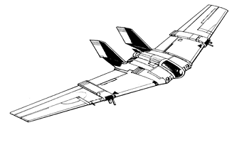
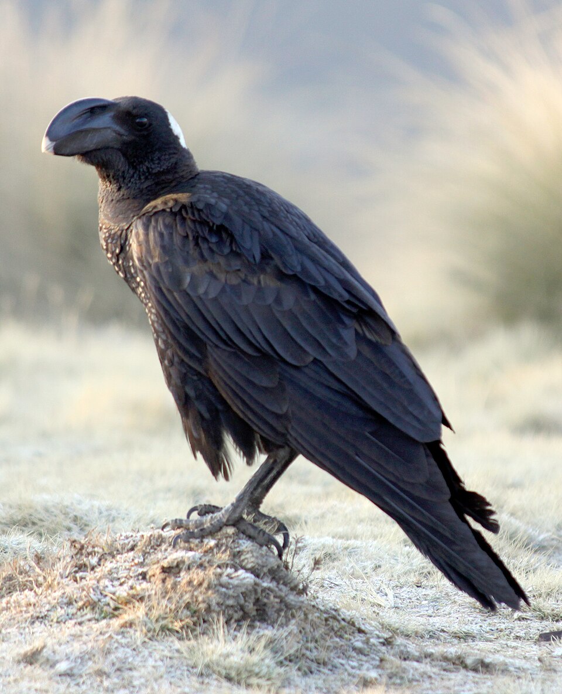

Experimental Aerospace Fighter Variants
********************************************************************************

.. |fa-asf| raw:: html

    <i class="fa-fw fa-solid fa-jet-fighter"></i>

I'm working on a Riever variant representing experimental R&D in the late Succession Wars era.

YF-100 "Raven"
--------------------------------------------------------------------------------

This Wolf's Dragoons experimental version of the Riever focuses on bomb capacity and high altitude bombing.
The SRM and LRM launchers have been removed, as well as 1 ton of AC/20 ammunition.
The internal space was converted to 4 bomb bays, each capable of holding 6 bombs.
The AC/20 was moved from the nose to the rear to provide a deterrent to other aerospace fighters strafing the Riever from the rear during a ground attack.

Following field testing, the AC/20 was downgraded to an AC/10 to make space for an ECM suite and an internal TAG pod.
With these modifications, Riever flights can support each other on deploying laser guided munitions when to ground forces with TAG are present.

The ultimate goal with this design is to create a precision high altitude bomber.

| |fa-asf| YF-100.1: `PDF <https://raw.githubusercontent.com/Eudicods/battletech-site/main/source/pdfs/Riever_YF-100.1.pdf>`_, `MegaMekLab file <https://raw.githubusercontent.com/Eudicods/battletech-site/main/source/mekfiles/Riever_YF-100.1>`_
| |fa-asf| YF-100.2: `PDF <https://raw.githubusercontent.com/Eudicods/battletech-site/main/source/pdfs/Riever_YF-100.2.pdf>`_, `MegaMekLab file <https://raw.githubusercontent.com/Eudicods/battletech-site/main/source/mekfiles/Riever_YF-100.2>`_
| |fa-asf| YF-100.3: `PDF <https://raw.githubusercontent.com/Eudicods/battletech-site/main/source/pdfs/Riever_YF-100.3.pdf>`_, `MegaMekLab file <https://raw.githubusercontent.com/Eudicods/battletech-site/main/source/mekfiles/Riever_YF-100.3>`_

