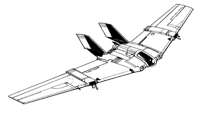
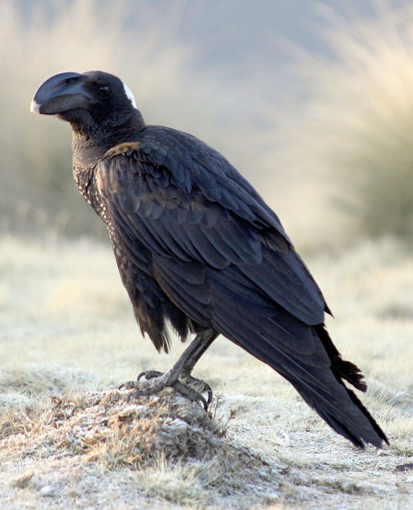

Experimental Aerospace Fighter Variants
********************************************************************************

.. |fa-asf| raw:: html

    <i class="fa-fw fa-solid fa-jet-fighter"></i>

I have a Riever variant representing experimental R&D in the late Succession Wars era.
The development of this ASF is heavily inspired by the `Boeing B-52 <https://en.wikipedia.org/wiki/Boeing_B-52_Stratofortress>`_.

FB-100 "Raven"
--------------------------------------------------------------------------------

This Wolf's Dragoons experimental version of the Riever focuses on bomb capacity and high altitude bombing.
The SRM and LRM launchers have been removed, as well as 1 ton of AC/20 ammunition.
The internal space was converted to 4 bomb bays, each capable of holding 6 bombs.
The AC/20 was moved from the nose to the rear to provide a deterrent to other aerospace fighters strafing the Riever from the rear during a ground attack.

Following field testing, the AC/20 was downgraded to an AC/10 to make space for an electronic countermeasures suite and an internal TAG pod.
With these modifications, Riever flights can support each other to deploy laser guided munitions when ground forces with Target Acquisition Gear are not present.

Two of the bomb bays can be configured to hold a rotary Arrow-IV launcher in order to deliver heavier munitions on ground targets.

Re-engining the Riever to use the Pitban 300 XL allowed the platform to carry an additional 6 tons of bombs while also upgrading the electronic countermeasures suite to an Angel suite and incorporating two laser anti-missile systems to improve survivability.

| |fa-asf| YFB-100: `PDF <https://raw.githubusercontent.com/Eudicods/battletech-site/main/source/pdfs/Riever_YFB-100.pdf>`_, `MegaMekLab file <https://raw.githubusercontent.com/Eudicods/battletech-site/main/source/mekfiles/Riever_YFB-100.blk>`_
| |fa-asf| FB-100A: `PDF <https://raw.githubusercontent.com/Eudicods/battletech-site/main/source/pdfs/Riever_FB-100A.pdf>`_, `MegaMekLab file <https://raw.githubusercontent.com/Eudicods/battletech-site/main/source/mekfiles/Riever_FB-100A.blk>`_
| |fa-asf| FB-100B: `PDF <https://raw.githubusercontent.com/Eudicods/battletech-site/main/source/pdfs/Riever_FB-100B.pdf>`_, `MegaMekLab file <https://raw.githubusercontent.com/Eudicods/battletech-site/main/source/mekfiles/Riever_FB-100B.blk>`_
| |fa-asf| FB-100C: `PDF <https://raw.githubusercontent.com/Eudicods/battletech-site/main/source/pdfs/Riever_FB-100C.pdf>`_, `MegaMekLab file <https://raw.githubusercontent.com/Eudicods/battletech-site/main/source/mekfiles/Riever_FB-100C.blk>`_
| |fa-asf| FB-100D: `PDF <https://raw.githubusercontent.com/Eudicods/battletech-site/main/source/pdfs/Riever_FB-100D.pdf>`_, `MegaMekLab file <https://raw.githubusercontent.com/Eudicods/battletech-site/main/source/mekfiles/Riever_FB-100D.blk>`_
| |fa-asf| FB-100E: `PDF <https://raw.githubusercontent.com/Eudicods/battletech-site/main/source/pdfs/Riever_FB-100E.pdf>`_, `MegaMekLab file <https://raw.githubusercontent.com/Eudicods/battletech-site/main/source/mekfiles/Riever_FB-100E.blk>`_

