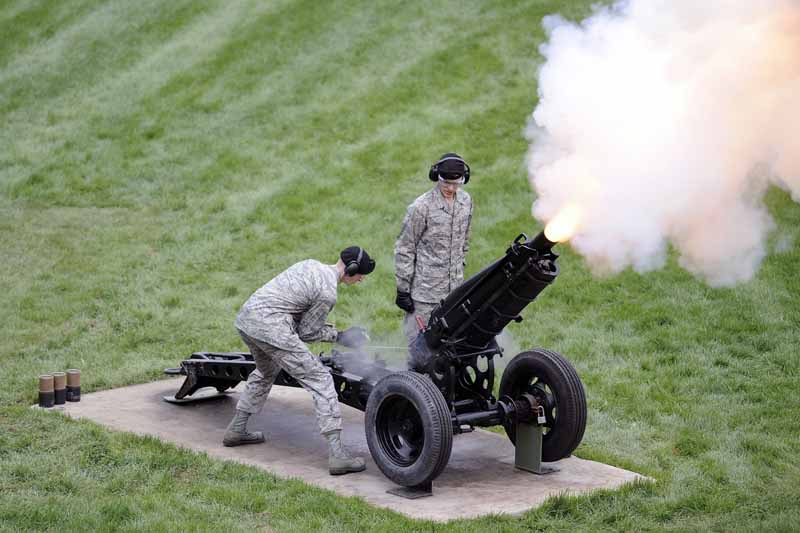

################################################################################
|icon| BattleTech
################################################################################

.. meta::
   :description: BattleTech projects by Jeremy L Thompson

.. |fa-mech| raw:: html

    <i class="fa-fw fa-solid fa-robot"></i>

.. |fa-trooper| raw:: html

    <i class="fa-fw fa-solid fa-person-rifle"></i>

.. |fa-book| raw:: html

    <i class="fa-fw fa-solid fa-book"></i>

I enjoy playing BattleTech and run demos.
It is especially important to me for new players to feel safe and welcome joining this hobby space.
See the `Colorado BattleTech <https://coloradobt.org>`_ website to find BattleTech players in Colorado.
I also help moderate the `Catalyst Game Labs Discord <https://discord.com/invite/catalystgamelabs>`_ community.

BattleTech: Outworlds Wastes
********************************************************************************

.. figure:: img/BattleTechOutworldsWastesLogo.webp
    :alt: BattleTech Outworlds Wastes logo
    :width: 250px

I've developed a lightweight narrative league and event framework with simplified logistics rules, BattleTech: Outworlds Wastes.

| |fa-mech| `BattleTech: Outworlds Wastes <https://outworlds-wastes.jeremylt.org>`_: lightweight narrative league and event framework

BattleTech: Outworlds Wastes also has a redesign based upon the new Chaos Campaign rules from the Mercenaries Box Set and BattleTech: Hinterlands sourcebook.

| |fa-mech| `BattleTech: Outworlds Wastes: Chaos Campaign <https://outworlds-wastes.jeremylt.org>`_: lightweight narrative league and event framework

Mercenary's Pride
********************************************************************************

.. figure:: img/MercenarysPrideLogo.webp
    :alt: Mercenary's Pride logo
    :width: 250px

Mercenary's Pride is a fun project retelling Jane Austin's Pride and Prejudice as a series of BattleTech scenarios and comm logs.

| |fa-book| `Mercenary's Pride <https://mercenarys-pride.jeremylt.org/>`_: retelling Pride and Prejudice in BattleTech

Skirmishers
********************************************************************************

Skirmishers is a work in progress effort to modernize BattleTroops.

| |fa-trooper| `Skirmishers <https://skirmishers.jeremylt.org/>`_: 28mm infantry combat

Alpha Strike Epic
********************************************************************************

Alpha Strike Epic is a series of Alpha Strike events for Colorado BattleTech with 100-200 minis on the table.

| |fa-mech| `Alpha Strike Epic <https://battletech.jeremylt.org/alpha-strike-epic>`_: More minis = more fun

Basic Artillery
********************************************************************************

I've always found it a bit odd that basic artillery trailers were not more common in BattleTech.
I've created basic Age of War and later era towed artillery units based upon the Early Republic era `Gun Trailer (Thumper) <https://masterunitlist.info/Unit/Details/6533/gun-trailer-thumper>`_.

| |fa-mech| `Basic Artillery <https://battletech.jeremylt.org/basic-artillery>`_: Big guns

Resources
********************************************************************************

I have a small list of common resources that are helpful for BattleTech players.

| |fa-mech| `References <https://outworlds-wastes.jeremylt.org/references>`_: Common references and tools
| |fa-mech| `Sample Forces <https://outworlds-wastes.jeremylt.org/sample-forces>`_: Sample 10,000 BV forces
| |fa-mech| `More Sample Forces <https://outworlds-chaos.jeremylt.org/sample-forces>`_: Sample 11,000 BV/400 PV
| |fa-mech| `Combat Vehicle Primer <https://outworlds-wastes.jeremylt.org/combat-vehicle-primer>`_: 'Mechs vs Combat Vehicles quick reference
| |fa-mech| `Classic BV Adjustments <https://outworlds-wastes.jeremylt.org/bv-adjustments>`_: Guide for force BV adjustments
