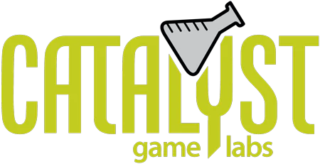
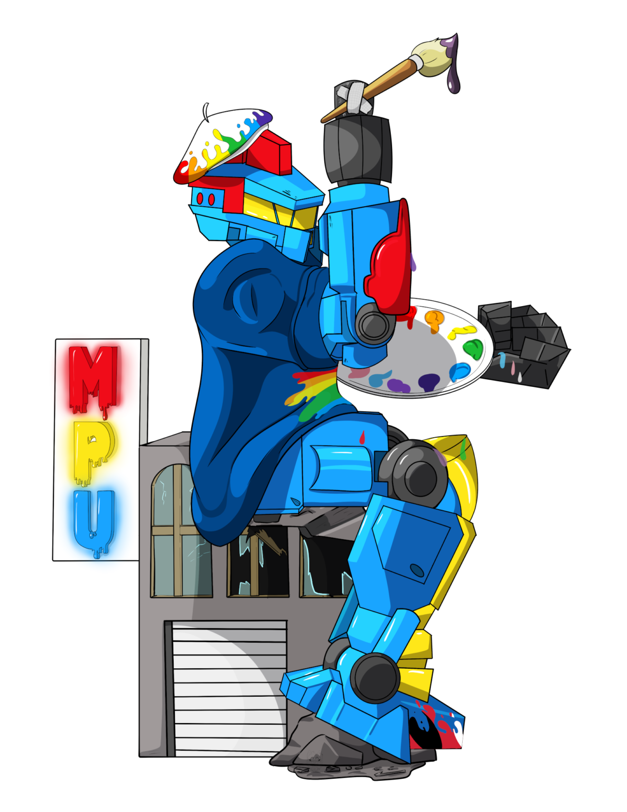

################################################################################
|icon| BattleTech
################################################################################

.. meta::
   :description: BattleTech projects by Jeremy L Thompson

.. |icon| image:: img/Icon.webp
    :alt: BattleTech icon
    :width: 50px

.. |fa-mech| raw:: html

    <i class="fa-fw fa-solid fa-robot"></i>

.. |fa-trooper| raw:: html

    <i class="fa-fw fa-solid fa-person-rifle"></i>

.. |fa-book| raw:: html

    <i class="fa-fw fa-solid fa-book"></i>

I enjoy playing BattleTech and run demos.
It is especially important to me for new players to feel safe and welcome joining this hobby space.

You can find more stuff I do on my `personal website <https://jeremylt.org>`_.

Communities
********************************************************************************

I help moderate the `Catalyst Game Labs Discord <https://discord.com/invite/catalystgamelabs>`_ community.

.. figure:: img/COBattleTechLogo.webp
    :alt: Colorado BattleTech logo
    :width: 250px

I enjoy playing BattleTech and run events as part of `Colorado BattleTech <https://coloradobt.org>`_.
See the `Colorado BattleTech <https://coloradobt.org>`_ website to find BattleTech players in Colorado.

The `‘Mech Painters Union <https://mechpainters.org/>`_ is a BattleTech fan group dedicated to working together for better painting.
We share miniatures that we’ve painted with advice to help each other improve our art.

Rules
********************************************************************************

BattleTech: Outworlds Wastes
--------------------------------------------------------------------------------

.. figure:: img/BattleTechOutworldsWastesLogo.webp
    :alt: BattleTech Outworlds Wastes logo
    :width: 250px

I've developed a lightweight narrative league and event framework with simplified logistics rules, BattleTech: Outworlds Wastes.

| |fa-mech| `BattleTech: Outworlds Wastes <https://outworlds-wastes.jeremylt.org>`_: lightweight narrative league and event framework

BattleTech: Outworlds Wastes also has a redesign based upon the new Chaos Campaign rules from the Mercenaries Box Set and BattleTech: Hinterlands sourcebook.

| |fa-mech| `BattleTech: Outworlds Wastes: Chaos Campaign <https://outworlds-wastes.jeremylt.org>`_: lightweight narrative league and event framework

Skirmishers
--------------------------------------------------------------------------------

.. figure:: img/Skirmishers.webp
    :alt: Skirmishers cover
    :width: 250px

Skirmishers is an effort to rebuild the old `BattleTroops <https://www.sarna.net/wiki/BattleTroops>`_ game from FASA.
We are attempting to overhaul and streamline the rules while expanding them to cover additional weapons and units.

| |fa-trooper| `Skirmishers <https://skirmishers.jeremylt.org/>`_: 28mm infantry combat

Scenarios
********************************************************************************

Mercenary's Pride
--------------------------------------------------------------------------------

.. figure:: img/MercenarysPrideLogo.webp
    :alt: Mercenary's Pride logo
    :width: 250px

Mercenary's Pride is a fun project retelling Jane Austin's Pride and Prejudice as a series of BattleTech scenarios and comm logs.

| |fa-book| `Mercenary's Pride <https://mercenarys-pride.jeremylt.org/>`_: retelling Pride and Prejudice in BattleTech

Alpha Strike Epic
--------------------------------------------------------------------------------

.. figure:: img/COBattleTechLogo.webp
    :alt: Colorado BattleTech logo
    :width: 250px

Alpha Strike Epic is a series of Alpha Strike events for Colorado BattleTech with 100-200 minis on the table.

| |fa-mech| `Alpha Strike Epic <https://battletech.jeremylt.org/alpha-strike-epic>`_: More minis = more fun

Pirate Point
--------------------------------------------------------------------------------

PIRATE POINT is a queer punk fanzine centered around the LGBTQIA+ Battletech community, and was created to provide a place for fans of stompy robots to express ourselves.
It is 100% free, made by fans for fans, and has no affiliation with Topps or Catalyst Game Labs.

I have submitted scenarios allowing players to fight 'Red Cell', a violent splinter group formed from Word of Blake remnants who mandate strict adherence to their interpretation of Blakeist ideology.

| |fa-mech| `Pirate Point Issue #1 <https://piratepoint.itch.io/issue-1>`_: March 2025
| |fa-mech| `Pirate Point Issue #2 <https://piratepoint.itch.io/pirate-point-issue-2>`_: September 2025
| |fa-mech| `Pirate Point Issue #3 <https://piratepoint.itch.io/pirate-point-issue-3>`_: March 2026

Units
********************************************************************************

Basic Artillery
--------------------------------------------------------------------------------

.. figure:: img/cannon.webp
    :alt: 75mm Howitzer
    :width: 250px

I've always found it a bit odd that basic artillery trailers were not more common in BattleTech.
I've created basic Age of War and later era towed artillery units based upon the Early Republic era `Gun Trailer (Thumper) <https://masterunitlist.info/Unit/Details/6533/gun-trailer-thumper>`_.

| |fa-mech| `Basic Artillery <https://battletech.jeremylt.org/basic-artillery>`_: Big guns

Experimental Atlas Variants
--------------------------------------------------------------------------------

.. figure:: img/atlas.webp
    :alt: BattleTech Atlas
    :width: 250px

I've worked on a few custom Atlas variants representing experimental R&D in the late Succession Wars era.

| |fa-mech| `Experimental Atlas Variants <https://battletech.jeremylt.org/atlas>`_: Big mechs

Resources
********************************************************************************

I have a small list of common resources that are helpful for BattleTech players.

| |fa-mech| `References <https://outworlds-wastes.jeremylt.org/references>`_: Common references and tools
| |fa-mech| `Sample Forces <https://outworlds-wastes.jeremylt.org/sample-forces>`_: Sample 10,000 BV forces
| |fa-mech| `More Sample Forces <https://outworlds-chaos.jeremylt.org/sample-forces>`_: Sample 11,000 BV/400 PV
| |fa-mech| `Combat Vehicle Primer <https://outworlds-wastes.jeremylt.org/combat-vehicle-primer>`_: 'Mechs vs Combat Vehicles quick reference
| |fa-mech| `Classic BV Adjustments <https://outworlds-wastes.jeremylt.org/bv-adjustments>`_: Guide for force BV adjustments
